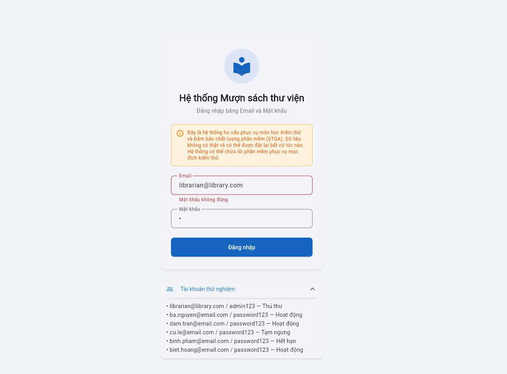
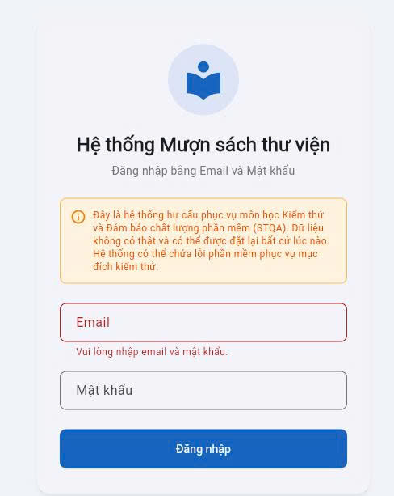
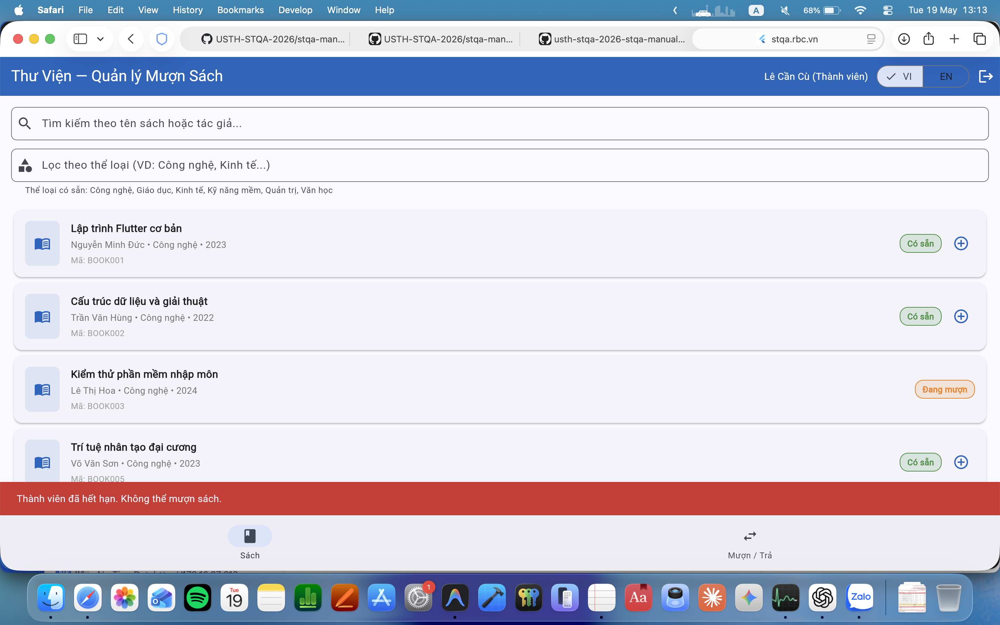
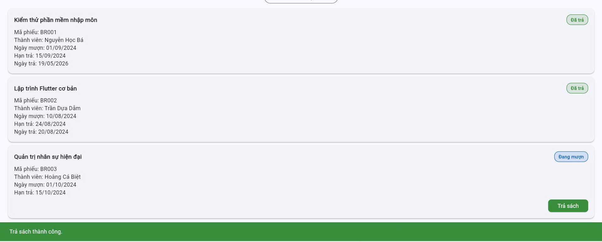
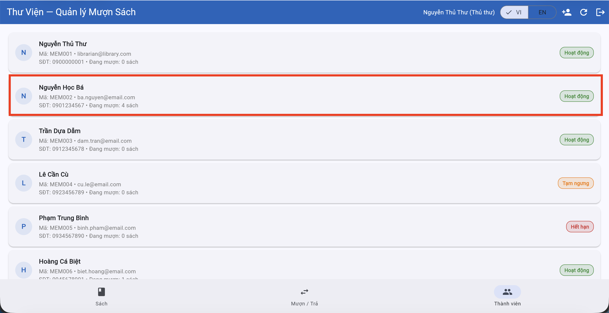
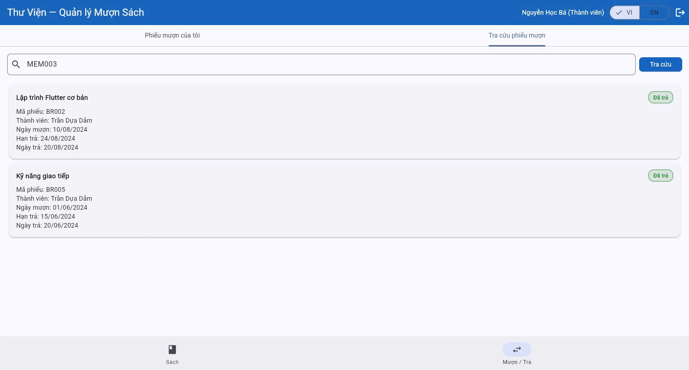

# Bug Reports

| Info | |
|---|---|
| **Group** | Group 09 |
| **Report Date** | 18/05/2026 |

---

## BUG-01

| Attribute | Detail |
|---|---|
| **Bug ID** | BUG-01 |
| **Related TC** | TC-02 |
| **Related REQ** | REQ-01 |
| **Severity** | Medium |
| **Discovered By** | Hoàng Minh Phúc |
| **Date Discovered** | 18/05/2026 |
| **Status** | Open |

**Title:** Entering a wrong password on login displays a wrong error message

**Environment:**
- Browser: Chrome 148.0.7778.168
- OS: Windows 10
- Interface Language: Vietnamese

**Precondition:** The login page at https://stqa.rbc.vn is open. The account `librarian@library.com` exists in the system.

**Steps to Reproduce:**
1. Open the login page.
2. Enter a valid, registered email: `librarian@library.com`.
3. Enter an incorrect password: `wrongpass`.
4. Click the **Login** button.

**Expected Result:** The system displays a clear, specific error message informing the user that the password is incorrect (e.g. "Incorrect password. Please try again.").

**Actual Result:** The system displays a wrong error message. If the password is incorrect, the email field will be highlighted with a message: "Password is not correct." 

**Impact:** Users can be confused. They might think the email is incorrect, so they will change the email address instead of correcting the password.

**Evidence:** 

**Suggested Fix:** In the authentication handler, separate the error cases: if the email is found but the password does not match, return a specific "Incorrect password" message rather than reusing a generic or wrong error string.

---

## BUG-02

| Attribute | Detail |
|---|---|
| **Bug ID** | BUG-02 |
| **Related TC** | TC-03 |
| **Related REQ** | REQ-01 |
| **Severity** | Medium |
| **Discovered By** | Hoàng Minh Phúc |
| **Date Discovered** | 18/05/2026 |
| **Status** | Open |

**Title:** Submitting the empty login form only highlights the email field — password field is not flagged; empty password field shows "please enter email and password" and vice versa.

**Environment:**
- Browser: Chrome 148.0.7778.168
- OS: Windows 10
- Interface Language: Vietnamese

**Precondition:** The login page is open. Both the email and password fields are empty.

**Steps to Reproduce:**
1. Open the login page.
2. Leave both the email and password fields completely blank.
3. Click the **Login** button.
4. Repeat step 1-3 but only leave the password/email field empty

**Expected Result:** The form is not submitted. Both the email field AND/OR the password field are highlighted with a validation error, informing the user that both are required.

**Actual Result:** Only the email field is highlighted with a validation error. The password field shows no indication that it is also required and empty and vice versa.

**Impact:** Users may believe only the email or password is needed, leading to confusion. Incomplete validation also creates an inconsistent experience — if the email is filled but password is still empty, the form might still submit. Violates REQ-01 input validation requirements.

**Evidence:**
 

**Suggested Fix:** Add a validation check for the password field as well. Both fields should be checked independently and both should display an error indicator when empty on form submission attempt.

---

## BUG-03

| Attribute | Detail |
|---|---|
| **Bug ID** | BUG-03 |
| **Related TC** | TC-05 |
| **Related REQ** | REQ-03 |
| **Severity** | Low |
| **Discovered By** | Trần Xuân Bắc |
| **Date Discovered** | 18/05/2026 |
| **Status** | Open |

**Title:** Pressing Enter after typing a search keyword does not trigger the search — manual button click required

**Environment:**
- Browser: Edge 148.0.3967.70
- OS: Windows 11
- Interface Language: English

**Precondition:** Logged in as librarian. The 'Search borrow records' page is open. A member ID that matches existing records is ready to be typed.

**Steps to Reproduce:**
1. Click the search input field.
2. Type the member ID `"MEM002"`.
3. Press the **Enter** key (without clicking the Search button).

**Expected Result:** The search executes immediately when the Enter key is pressed, and matching results are displayed — consistent with standard web search behaviour.

**Actual Result:** Nothing happens when Enter is pressed. The user must manually click the Search button to trigger the search.

**Impact:** This is a usability issue. Pressing Enter to submit a search is a universal browser convention. Forcing users to click the button after every search slows down workflow and is inconsistent with user expectations.

**Evidence:** 
<video src="evidences/bug03.mp4" controls width="700"></video>

**Suggested Fix:** Add a `keydown` event listener (or `keypress`) on the search input field that triggers the search function when the Enter key (keyCode 13) is detected.

---

## BUG-04

| Attribute | Detail |
|---|---|
| **Bug ID** | BUG-04 |
| **Related TC** | TC-10 |
| **Related REQ** | REQ-04 |
| **Severity** | Medium |
| **Discovered By** | Trần Ngọc Hải |
| **Date Discovered** | 18/05/2026 |
| **Status** | Open |

**Title:** When a member with "Suspended" status attempts to borrow, the system shows the "Expired" error message instead of a "Suspended" message

**Environment:**
- Browser: Safari 26.4
- OS: macOS 26
- Interface Language: Vietnamese

**Precondition:** Logged in as a suspended member (MEM004). MEM004 has membership status "Suspended". An available book exists in the system.

**Steps to Reproduce:**
1. In the 'Book' page, click + to borrow
2. Click 'borrow' button to execute

**Expected Result:** The system rejects the borrow and displays an error message that correctly refers to membership suspension (e.g. "This member is suspended"). This message must be **distinct** from the expired member message.

**Actual Result:** The system displays the message "Thành viên hết hạn" ("Member expired") even though MEM004's status is "Suspended", not "Expired". The wrong status is communicated.

**Impact:** This can cause misunderstanding, incorrect decisions and unnecessary support requests.

**Evidence:** 

**Suggested Fix:** In the borrow logic, separate the error handling for "Suspended" and "Expired" member statuses. Each status should map to its own distinct error message string.

---

## BUG-05

| Attribute | Detail |
|---|---|
| **Bug ID** | BUG-05 |
| **Related TC** | TC-15 |
| **Related REQ** | REQ-05 |
| **Severity** | High |
| **Discovered By** | Ngô Tuấn Duy |
| **Date Discovered** | 18/05/2026 |
| **Status** | Open |

**Title:** No overdue warning is displayed when a book is returned after its due date

**Environment:**
- Browser: Chrome 148.0.7778.168
- OS: Windows 11
- Interface Language: Vietnamese

**Precondition:** Logged in as librarian. BOOK003 is on loan to MEM002 (Nguyễn Học Bá). The due date for the loan has already passed (e.g. due 15/09/2024, returning on 18/05/2026).

**Steps to Reproduce:**
1. Navigate to the Return Book section.
2. Select BOOK003 for member MEM002.
3. Process the return on a date after the due date.

**Expected Result:** The return is accepted AND the system prominently displays an overdue warning message indicating the book was returned late.

**Actual Result:** The return is processed silently with no overdue warning. The system behaves identically to an on-time return, with no indication that the book was late.

**Impact:** Overdue returns go completely unnoticed. Library staff cannot enforce late return policies, calculate penalties, or track habitual late returners. This is a core policy enforcement failure defined in REQ-05.

**Evidence:** 

**Suggested Fix:** After confirming a return, compare the actual return date against the due date. If `return_date > due_date`, display an overdue warning banner. Optionally calculate and display the number of overdue days.

---

## BUG-06

| Attribute | Detail |
|---|---|
| **Bug ID** | BUG-06 |
| **Related TC** | TC-19 |
| **Related REQ** | REQ-07 |
| **Severity** | Medium |
| **Discovered By** | Trần Ngọc Hải |
| **Date Discovered** | 18/05/2026 |
| **Status** | Open |

**Title:** Email address without a dot in the domain is accepted when registering a new member and vice versa (emails with dots are not accepted).

**Environment:**
- Browser: Safari 26.4
- OS: macOS 26
- Interface Language: Vietnamese

**Precondition:** Logged in as librarian. The Add New Member page is open.

**Steps to Reproduce:**
1. Navigate to Add New Member.
2. Fill in all required fields with valid data.
3. In the email field, enter: `newmember@examplecom` (missing the dot in the domain).
4. Click **Submit**.
5. Repeat step 1-4 but with a valid email with **dot** in domain

**Expected Result:** The form is rejected for `newmember@examplecom` (invalid format). The form is accepted for `newmember@example.com` (valid format).

**Actual Result:** The form is accepted for `newmember@examplecom` (invalid format). The form is rejected for `newmember@example.com` (valid format).

**Impact:** Invalid email addresses are stored in the system. These addresses cannot receive emails, making it impossible to contact the member. This also corrupts data integrity and violates REQ-07 email validation requirements.

**Evidence:**  
<video src="evidences/bug06.mov" controls width="700"></video>

**Suggested Fix:** Apply a strict email format validation that requires at least one dot in the domain portion. Validation should be enforced both on the frontend (for UX) and backend (for security).

---

## BUG-07

| Attribute | Detail |
|---|---|
| **Bug ID** | BUG-07 |
| **Related TC** | TC-13 |
| **Related REQ** | REQ-04 |
| **Severity** | High |
| **Discovered By** | Nguyễn Tuấn Khải |
| **Date Discovered** | 18/05/2026 |
| **Status** | Open |

**Title:** Members can borrow up to 4 books — borrow limit should be enforced at 3 per SRS

**Environment:**
- Browser: Chrome 148.0.7778.168
- OS: Windows 11
- Interface Language: Vietnamese

**Precondition:** Logged in as Nguyễn Học Bá. An additional available book exists.

**Steps to Reproduce:**
1. In the 'Book' page, click + to borrow
2. Click 'borrow' button to execute
3. MEM002 has 2 books, now borrow 2 more

**Expected Result:** The system rejects the request and displays: "Borrow limit reached. A member may borrow a maximum of 3 books at one time."

**Actual Result:** The system allows the borrow. The member now holds 4 books simultaneously, exceeding the 3-book limit defined in the SRS.

**Impact:** The borrow limit policy is not enforced. Members can accumulate more books than allowed, reducing availability for other users and violating the core business rule defined in REQ-04.

**Evidence:** 

**Suggested Fix:** In the borrow transaction logic, query the member's current active borrow count before confirming. If `active_loans >= 3`, reject the request with the appropriate limit message. The threshold value (3) should ideally be configurable.

---

## BUG-08

| Attribute | Detail |
|---|---|
| **Bug ID** | BUG-08 |
| **Related TC** | TC-16 |
| **Related REQ** | REQ-06 |
| **Severity** | High |
| **Discovered By** | Ngô Tuấn Duy |
| **Date Discovered** | 18/05/2026 |
| **Status** | Open |

**Title:** A logged-in member can view the borrow records of other members — no access control enforced

**Environment:**
- Browser: Chrome 148.0.7778.168
- OS: Windows 11
- Interface Language: Vietnamese

**Precondition:** Logged in as MEM002. MEM003 is a different member who has existing borrow records in the system.

**Steps to Reproduce:**
1. Log in as MEM002.
2. Navigate to the member borrow history or records section.
3. Attempt to access or view the records of MEM003.

**Expected Result:** Access is denied. The system either redirects MEM002 to their own records, or displays "Access denied. You can only view your own records."

**Actual Result:** MEM002 can successfully view MEM003's borrow records. No access control or ownership check is enforced.

**Impact:** This is a serious privacy and security violation. Members can view sensitive personal data (which books others have borrowed, borrowing history) of other members without authorisation. This violates REQ-06 and general data privacy principles.

**Evidence:** 

**Suggested Fix:** Enforce server-side ownership checks on all record retrieval endpoints. When a member requests borrow history, verify that the requested member ID matches the session's authenticated user ID. If not, return a 403 Forbidden response.

---

## BUG-09

| Attribute | Detail |
|---|---|
| **Bug ID** | BUG-09 |
| **Related TC** | TC-17 |
| **Related REQ** | REQ-05 |
| **Severity** | High |
| **Discovered By** | Trần Xuân Bắc |
| **Date Discovered** | 18/05/2026 |
| **Status** | Open |

**Title:** A member can process the return of a book that was borrowed by a different member

**Environment:**
- Browser: Edge 148.0.3967.70
- OS: Windows 11
- Interface Language: Vietnamese

**Precondition:** Logged in as MEM002. BOOK005 is currently on loan to MEM003 (not MEM002).

**Steps to Reproduce:**
1. Log in as MEM002.
2. Navigate to the Return Book section.
3. Enter or select BOOK005 (which belongs to MEM003's active loan).
4. Click **Return**.

**Expected Result:** The system rejects the return and displays: "This book does not belong to your account. You can only return books you have borrowed."

**Actual Result:** The return is accepted. The system removes BOOK005 from MEM003's active loan and marks it as returned, even though MEM002 processed the transaction.

**Impact:** Any member can clear another member's loan records, creating fraudulent return records, potentially allowing others to avoid overdue fees, and corrupting loan data integrity. This is a critical data integrity and security defect.

**Evidence:** 
<video src="evidences/bug09.mp4" controls width="700"></video>

**Suggested Fix:** Before processing any return, verify that the book's current loan record is linked to the session's authenticated member ID. If the IDs do not match, reject the return with an appropriate error message. This check must be enforced server-side to prevent bypass via direct API calls.

---

## BUG-10

| Attribute | Detail |
|---|---|
| **Bug ID** | BUG-10 |
| **Related TC** | TC-06 |
| **Related REQ** | REQ-03 |
| **Severity** | Low |
| **Discovered By** | Nguyễn Tuấn Khải |
| **Date Discovered** | 19/05/2026 |
| **Status** | Open |

**Title:** The system doesn't return records when searching by member ID in lowercase letters

**Environment:**
- Browser: Chrome 148.0.7778.168
- OS: Windows 11
- Interface Language: Vietnamese

**Precondition:** Logged in as the Librarian/Member. Then, click on the tab 'Book / Return' to search records by member ID. 

**Steps to Reproduce:**
1. Log in as the Librarian/Member.
2. Navigate to the 'Borrow / Return' tab.
3. In the search field labelled "Enter Member ID (e.g., MEM001)", enter MEM002.
4. Click Search.
5. Observe the result.
6. Clear the field. Enter mem002 in all lowercase and search again.

**Expected Result:** 
- Steps 3–4: The system returns all borrow records belonging to MEM002.
- Step 6: The system still returns MEM002's borrow records (search should be case-insensitive per REQ-03's general principle of case-insensitive searching).

**Actual Result:** 
- Steps 3–4: The system successfully returns all borrow records belonging to MEM002
- Step 6: No records are returned.

**Impact:** Users may fail to find existing members if they type different letter casing. Usability is reduced and poor. They can also surface slow workflows.

**Evidence:** 

**Suggested Fix:** Apply lowercase to search field when searching for borrow records.
